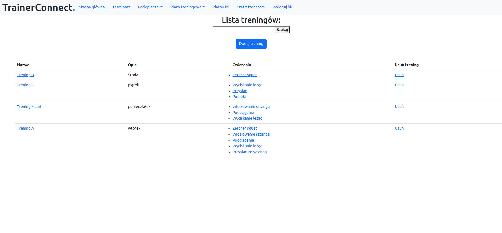
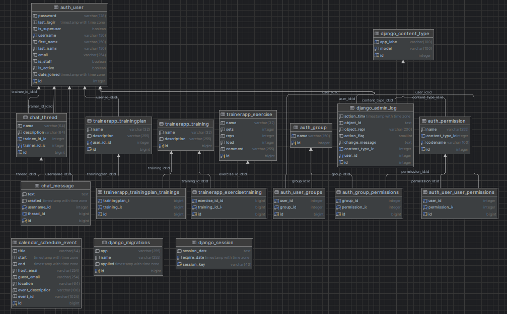

# TrainerConnect.

An app designed for personal trainers and their trainees. It implements a functionality of adding exercises, trainings and training plans for specific users. It also has a message board for users and their trainer.

# Setup of the app
To install requirements of the project execute the following command:

`$ pip install -r requirements.txt`

Establish connection to a database of your choice. I used PostgreSQL for this project.
Create migrations and migrate:

`$ python manage.py makemigrations` then `$ python manage.py migrate`

To start the app:

`$ python manage.py runserver`

# Preview and database structure

